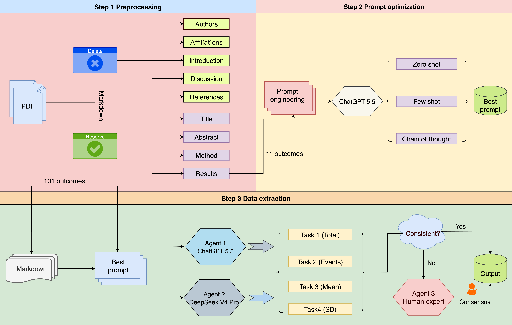

# AI-Human Workflow for Data Extraction
We implemented a multi-agent workflow in LangChain to simulate AI-human extraction of data required for meta-analysis. The workflow comprised two LLM reviewers and one human adjudicator. Reviewer 1 used ChatGPT 5.5, and reviewer 2 used deepseek-V4-Pro. Both reviewers received identical prompts and independently extracted data without access to each other’s outputs. Whenever their outputs differed, a human expert consulted the source report and determined the final value.

This project provides an LLM-based human–AI collaborative data extraction workflow, including prompt optimization, human–AI interactive data extraction, and scripts for similarity analysis and evaluation.


This workflow diagram is licensed under the MIT License.

Usage & Modification Rights:
* Minor modifications or structural adjustments tailored for individual implementation are permitted.
* Plagiarism, verbatim copying, or deceptive derivation of the workflow diagrams and core architecture are strictly prohibited.
* The methodology, figures, and conceptual workflow may not be reproduced or redistributed for commercial purposes or published scientific studies without proper citation and explicit authorization from the author.

---

## 📁 Project Directory Structure

```text
.
├── AI-Human workflow/        # Core scripts for LLM-based human–AI collaborative data extraction
│   ├── Agent-Binary.py       # Binary Outcome Data Extraction Scripts
│   └── Agent-Continuous.py   # Continuous Outcome Data Extraction Scripts
├── Similarity/            # Text Similarity and Evaluation Scripts
│   ├── bert score.py         # BERT Score-Based Text Semantic Similarity Calculation
│   └── text 3 large.py       # Computing Text Cosine Similarity Using the OpenAI Embeddings API
├── test/                  # Prompt Optimization and Testing Scripts
│   ├── test-Binary.py        # Binary Outcome Prompt Optimization Scripts
│   └── test-Continuous.py    # Continuous Outcome Prompt Optimization Scripts
├── data/                  # Data Input Directory
└── requirements.txt       # Project Dependency List
```

---

## 🚀 Environment Setup and Installation

### 1. Clone This Repository
Please clone the repository using the PyCharm terminal.
```bash
git clone [https://github.com/tcmchen7410-bot/AI-human-workflow.git](https://github.com/tcmchen7410-bot/AI-human-workflow.git)
cd AI-human-workflow
```

### 2. Create and Activate a Virtual Environment
Run the following commands in the terminal to create and activate a virtual environment:

```bash
# Create a Virtual Environment
python3 -m venv .venv

# Activate the Virtual Environment
source .venv/bin/activate
```

### 3. Install Dependencies
In the activated virtual environment terminal, run the following command to install the required project dependencies:

```bash
pip install -r requirements.txt
```

---

## ⚙️ Core Modules and Usage Instructions

### 1. 💡 Prompt Optimization
Used for testing and optimizing prompt performance before formal data extraction:
* `test/test-Binary.py`：Prompt optimization for binary outcomes (e.g., yes/no, presence/absence).
* `test/test-Continuous.py`：Prompt optimization for continuous outcomes (e.g., numerical values, proportions, and scores).

### 2. 🤖 AI-Human workflow
Core Data Extraction Pipeline:
* `AI-Human workflow/Agent-Binary.py`：Human–AI collaborative automated extraction script for binary outcomes.
* `AI-Human workflow/Agent-Continuous.py`：Human–AI Collaborative Automated Extraction Script for Continuous Outcomes.

### 3. 📊 Similarity Computation and Evaluation
Used to evaluate the semantic consistency between Chain-of-Thought (CoT) reasoning texts generated by two LLMs during the data extraction process.
* `Similarity/bert score.py`：Calculate semantic similarity scores using BERTScore.
* `Similarity/text 3 large.py`：Use the OpenAI Embeddings API to calculate high-dimensional cosine similarity. This script should be executed in the terminal:
```bash
export OPENAI_API_KEY="your openai key"
python Similarity/"text 3 large.py"
``` 
## 📧 Contact

For questions or further information, please contact:

**Guang Chen**  

Chengdu University of Traditional Chinese Medicine  

E-mail: tcm_chen7410@163.com